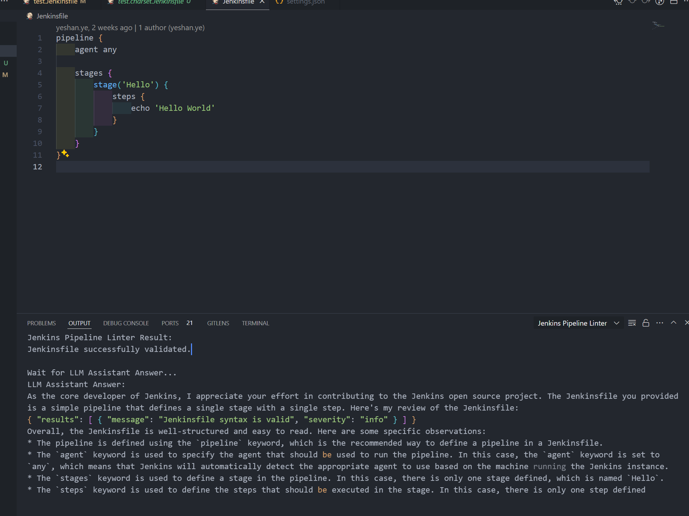

# jenkins-pipeline-linter-connector

[](https://open-vsx.org/extension/yeshan333/jenkins-pipeline-linter-connector-fork) [](https://marketplace.visualstudio.com/items?itemName=yeshan333.jenkins-pipeline-linter-connector-fork)

This extension validates Jenkinsfile by sending them to the [Jenkins Pipeline Linter](https://www.jenkins.io/doc/book/pipeline/development/#linter) of a Jenkins server. Also support to review Jenkinsfile with LLMs.

## Features

- Validate [declarative Jenkinsfile](https://www.jenkins.io/doc/book/pipeline/syntax/#declarative-pipeline) in [Visual Studio Code](https://code.visualstudio.com/).
- Review Jenkinsfile with LLMs.

## Example Usage


## Extension Settings

This extension contributes the following settings:

* `jenkins.pipeline.linter.connector.url`: is the endpoint at which your Jenkins Server expects the POST request, containing your Jenkinsfile which you want to validate. Typically this points to `<your_jenkins_server:port>/pipeline-model-converter/validate`.
* `jenkins.pipeline.linter.connector.crumbUrl`: has to be specified if your Jenkins Server has CRSF protection enabled. (eg: `https://<your-jenkins-server>:<port>/crumbIssuer/api/xml?xpath=concat(//crumbRequestField,\":\",//crumb)`).
* `jenkins.pipeline.linter.connector.user`: allows you to specify your Jenkins username.
* `jenkins.pipeline.linter.connector.pass`: allows you to specify your Jenkins password.
* `jenkins.pipeline.linter.connector.token`: Jenkins [user API token](https://www.baeldung.com/ops/jenkins-api-token).
* `jenkins.pipeline.linter.onsave`: controls whether the Jenkinsfile is checked immediately after it is saved (default: false).
* `jenkins.pipeline.linter.checkextensions`: you can control what file can be checked through this configuration. (default: `[".jenkinsfile", ".groovy", "Jenkinsfile"]`). It means that the file name being checked must contains one of them.

### example settings

Scenario 1: Jenkins does not have API authentication enabled

```json
{
    "jenkins.pipeline.linter.connector.url": "https://jenkins.shan333.cn/pipeline-model-converter/validate",
}
```

Scenario 2: Jenkins has API authentication enabled. Use a password for authentication.

```json
{
    "jenkins.pipeline.linter.connector.url": "https://jenkins.shan333.cn/pipeline-model-converter/validate",
    "jenkins.pipeline.linter.connector.user": "jenkins_username",
    "jenkins.pipeline.linter.connector.pass": "jenkins_password",
    "jenkins.pipeline.linter.connector.token": "user_api_token"
}
```

Scenario 3: Jenkins has API authentication enabled. Use a API token for authentication.

```json
{
    "jenkins.pipeline.linter.connector.url": "https://jenkins.shan333.cn/pipeline-model-converter/validate",
    "jenkins.pipeline.linter.connector.user": "jenkins_username",
    "jenkins.pipeline.linter.connector.token": "user_api_token"
}
```

Scenario 4: Jenkins has API authentication enabled and CRSF protection enabled.

```json
{
    "jenkins.pipeline.linter.connector.url": "https://jenkins.shan333.cn/pipeline-model-converter/validate",
    "jenkins.pipeline.linter.connector.user": "jenkins_username",
    "jenkins.pipeline.linter.connector.pass": "jenkins_password",
    "jenkins.pipeline.linter.connector.token": "user_api_token",
    "jenkins.pipeline.linter.connector.crumbUrl": "https://jenkins.shan333.cn/crumbIssuer/api/xml?xpath=concat(//crumbRequestField,\":\",//crumb)"
}
```

### Enable review with LLM

You can also enable linter with LLMs. We use the Cloudflare ("赛博佛祖") Workers AI REST API to get reviews of your Jenkinsfile. 



This is an example configuration to enable this feature:

```json
{
    "jenkins.pipeline.linter.connector.llm.enable": true,
    "jenkins.pipeline.linter.connector.llm.baseUrl": "https://api.cloudflare.com/client/v4/accounts/<CF_ACCOUNT_ID>/ai/v1",
    "jenkins.pipeline.linter.connector.llm.modelName": "@cf/meta/llama-2-7b-chat-fp16",
    "jenkins.pipeline.linter.connector.llm.apiKey": "<CF_API_TOKEN>",
}
```

* `jenkins.pipeline.linter.connector.llm.enable`: Whether to enable this feature (default: false).
* `jenkins.pipeline.linter.connector.llm.baseUrl`: You can refer to this document to get your openapi -> [Get started with the Workers AI REST API](https://developers.cloudflare.com/workers-ai/get-started/rest-api/), We use [openapi compatibility](https://developers.cloudflare.com/workers-ai/configuration/open-ai-compatibility/) mode to call it.
* `jenkins.pipeline.linter.connector.llm.modelName`: Any of the text generation model ID mentioned in this document -> [https://developers.cloudflare.com/workers-ai/models/#text-generation](https://developers.cloudflare.com/workers-ai/models/#text-generation), defailt is: `@cf/meta/llama-2-7b-chat-fp16`.
* `jenkins.pipeline.linter.connector.llm.apiKey`: Your Cloudflare API token.

## Acknowledgements

- [Publishing Extensions](https://code.visualstudio.com/api/working-with-extensions/publishing-extension)
- Project modified from: [https://github.com/4roring/vscode-jenkins-pipeline-linter-connector](https://github.com/4roring/vscode-jenkins-pipeline-linter-connector)
