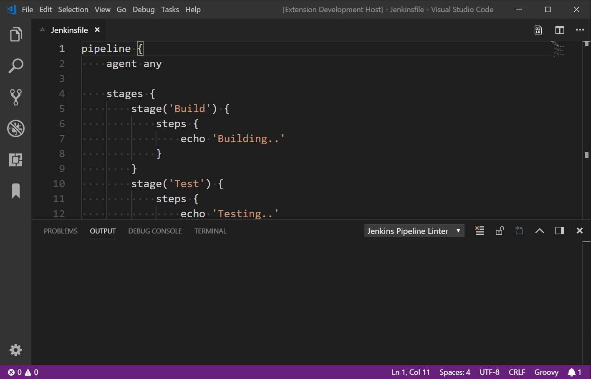

# jenkins-pipeline-linter-connector

This extension validates Jenkinsfile by sending them to the [Jenkins Pipeline Linter](https://www.jenkins.io/doc/book/pipeline/development/#linter) of a Jenkins server.

## Features

- Validate [declarative Jenkinsfile](https://www.jenkins.io/doc/book/pipeline/syntax/#declarative-pipeline) in [Visual Studio Code](https://code.visualstudio.com/).

## Example Usage




## Extension Settings

This extension contributes the following settings:

* `jenkins.pipeline.linter.connector.url`: is the endpoint at which your Jenkins Server expects the POST request, containing your Jenkinsfile which you want to validate. Typically this points to `<your_jenkins_server:port>/pipeline-model-converter/validate`.
* `jenkins.pipeline.linter.connector.crumbUrl`: has to be specified if your Jenkins Server has CRSF protection enabled. (eg: `https://<your-jenkins-server>:<port>/crumbIssuer/api/xml?xpath=concat(//crumbRequestField,\":\",//crumb)`).
* `jenkins.pipeline.linter.connector.user`: allows you to specify your Jenkins username.
* `jenkins.pipeline.linter.connector.pass`: allows you to specify your Jenkins password.
* `jenkins.pipeline.linter.connector.token`: Jenkins [user API token](https://www.baeldung.com/ops/jenkins-api-token).
* `jenkins.pipeline.linter.onsave`: controls whether the Jenkinsfile is checked immediately after it is saved (default: false).
* `jenkins.pipeline.linter.checkextensions`: you can control what file can be checked through this configuration. (default: `[".jenkinsfile", ".groovy", "Jenkinsfile"]`). It means that the file name being checked must contains one of them.

### example settings

Scenario 1: Jenkins does not have API authentication enabled

```json
{
    "jenkins.pipeline.linter.connector.url": "https://jenkins.shan333.cn/pipeline-model-converter/validate",
}
```

Scenario 2: Jenkins has API authentication enabled. Use a password for authentication.

```json
{
    "jenkins.pipeline.linter.connector.url": "https://jenkins.shan333.cn/pipeline-model-converter/validate",
    "jenkins.pipeline.linter.connector.user": "jenkins_username",
    "jenkins.pipeline.linter.connector.pass": "jenkins_password",
    "jenkins.pipeline.linter.connector.token": "user_api_token"
}
```

Scenario 3: Jenkins has API authentication enabled. Use a API token for authentication.

```json
{
    "jenkins.pipeline.linter.connector.url": "https://jenkins.shan333.cn/pipeline-model-converter/validate",
    "jenkins.pipeline.linter.connector.user": "jenkins_username",
    "jenkins.pipeline.linter.connector.token": "user_api_token"
}
```

Scenario 4: Jenkins has API authentication enabled and CRSF protection enabled.

```json
{
    "jenkins.pipeline.linter.connector.url": "https://jenkins.shan333.cn/pipeline-model-converter/validate",
    "jenkins.pipeline.linter.connector.user": "jenkins_username",
    "jenkins.pipeline.linter.connector.pass": "jenkins_password",
    "jenkins.pipeline.linter.connector.token": "user_api_token",
    "jenkins.pipeline.linter.connector.crumbUrl": "https://jenkins.shan333.cn/crumbIssuer/api/xml?xpath=concat(//crumbRequestField,\":\",//crumb)"
}
```

## Acknowledgements

- [Publishing Extensions](https://code.visualstudio.com/api/working-with-extensions/publishing-extension)
- Project modified from: [https://github.com/4roring/vscode-jenkins-pipeline-linter-connector](https://github.com/4roring/vscode-jenkins-pipeline-linter-connector)
